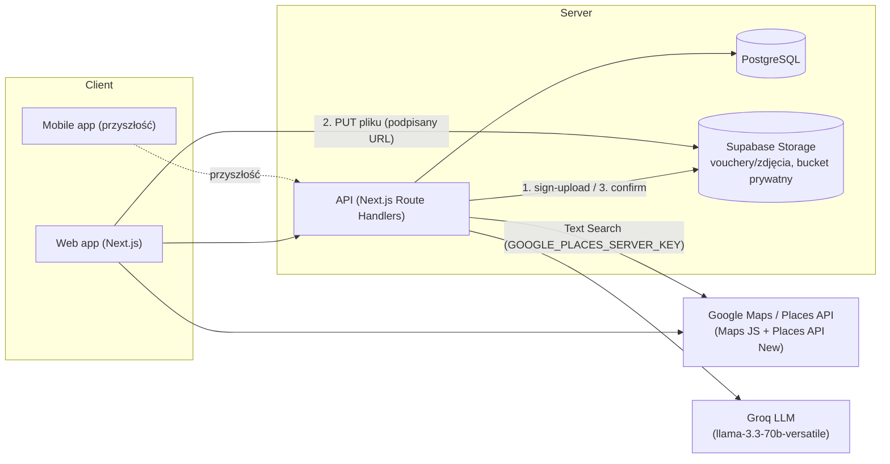
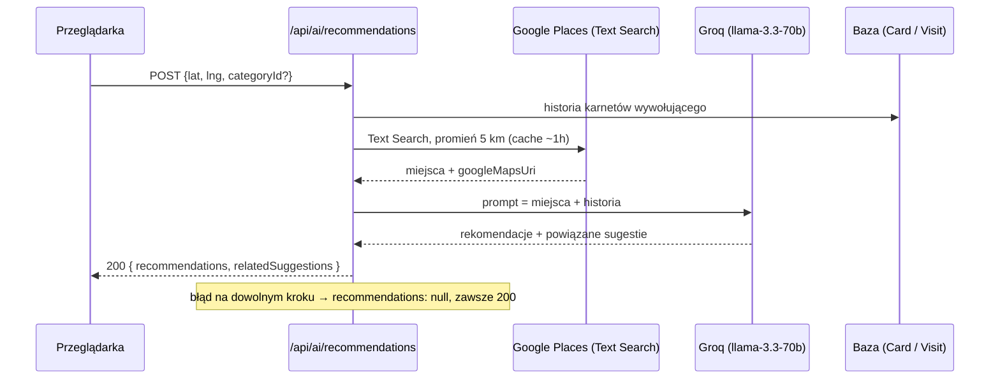
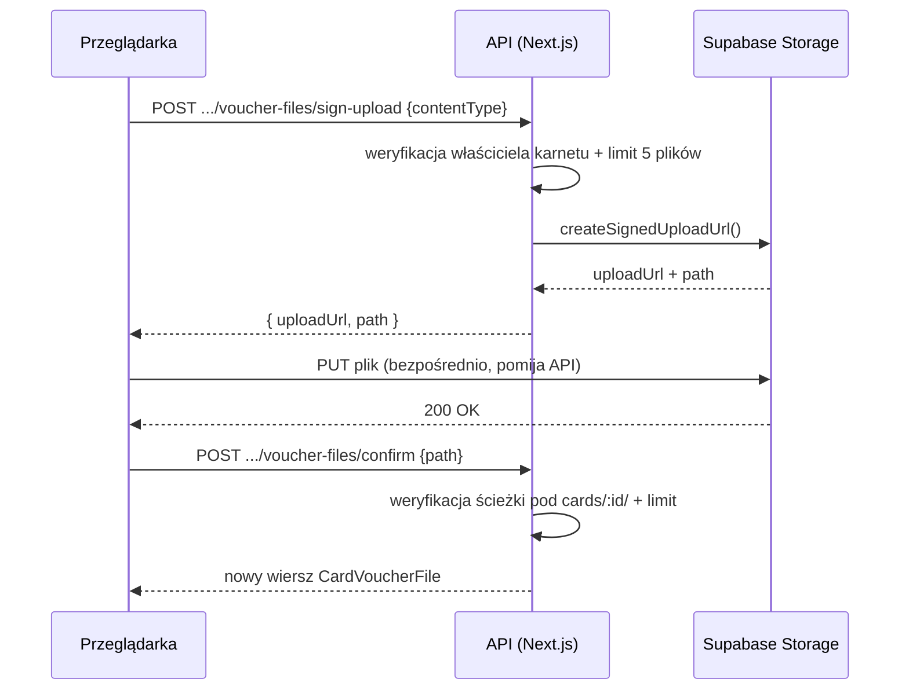

# Architektura — KARNET.asist

> Nazwa projektu: KARNET.asist · Wersja: v2 · Zapisano: 2026-08-02 00:08
> Zaktualizowano: 2026-08-16 (Faza V5b — przeprojektowanie mobilne + PWA/Web Push;
> poprzednio 2026-08-09, Faza V4 — Doradca AI, upload vouchera do Supabase Storage)

> Status: stos techniczny potwierdzony (ADR-001, ADR-002) — patrz
> [DECISIONS.md](DECISIONS.md). Sekcje dotyczące Google Maps/Places (ADR-004), Doradcy AI
> (ADR-008), uploadu vouchera (ADR-009) i PWA/Web Push (niżej) opisują stan faktycznie
> zaimplementowany, nie propozycję. Web Push wymaga jeszcze zmiennych środowiskowych
> (VAPID/CRON_SECRET) na produkcji i testu na urządzeniu — patrz `plan-pracy-claude-code.md`,
> sekcja „Faza V5b”, checklista na końcu.

## Widok systemu

W prototypie frontend, "backend" i "baza danych" to jeden statyczny plik HTML z danymi
trzymanymi w pamięci JS (`let cards = [...]`, `let partners = [...]`) — znikają po
odświeżeniu strony. Produkcyjna wersja rozdziela to na realny frontend, API i trwałą bazę
danych.

**Google Maps/Places (Sesja V4.1, ADR-004):** przeglądarka woła Google bezpośrednio
(`Web --> GMaps`), nie przez własne API — wyszukiwanie firmy (Places API (New)) i mapa
lokalizacji (Maps JavaScript API) działają po stronie klienta przez
`@vis.gl/react-google-maps`. Serwer (`API`) zapisuje jedynie wynik (`lat`/`lng`/
`googlePlaceId`) w `companies`, tak jak każde inne pole formularza — nie pośredniczy w
samym wywołaniu do Google.

**Doradca AI (Sesja V4.2, ADR-008):** `/recommendations` woła własny endpoint
`POST /api/ai/recommendations`, który po stronie serwera łączy wynik Google Places API
(New) Text Search (klucz `GOOGLE_PLACES_SERVER_KEY`, **inny** niż kliencki
`NEXT_PUBLIC_GOOGLE_MAPS_API_KEY` powyżej) z historią karnetów wywołującego z własnej
bazy, i dopiero ten kontekst wysyła do Groq (`llama-3.3-70b-versatile`, zwykły `fetch`,
bez dodatkowej zależności npm). Groq nie ma dostępu do internetu — pełni tylko rolę
warstwy syntezy nad faktami dostarczonymi przez backend; prompt systemowy zabrania
wymyślania nazw miejsc spoza dostarczonych list. Każdy błąd zewnętrznego API (brak
klucza, timeout, zły JSON) jest łapany po stronie serwera i zwraca `null` — endpoint
zawsze odpowiada `200`, strona pokazuje wtedy łagodny komunikat "brak rekomendacji", bez
rozróżnienia dla użytkownika między "nic w okolicy" a "błąd integracji" (błędy widoczne
tylko w logach serwera).

**Upload vouchera (Sesja V4.3, ADR-009; wiele plików od Sesji V6.2):** pliki/zdjęcia
vouchera (do 5 na karnet) **nie** przechodzą przez `API` — trafiają bezpośrednio z
przeglądarki do Supabase Storage. Powód: limit ciała requestu na Vercel Serverless
Functions (~4.5 MB) jest mniejszy niż dopuszczalny rozmiar pliku (10 MB). Flow
trójkrokowy, powtarzany dla każdego pliku: (1) `POST .../voucher-files/sign-upload` —
serwer weryfikuje właściciela karnetu i limit plików, zwraca podpisany URL do zapisu; (2)
przeglądarka wysyła plik zwykłym `PUT` prosto do Supabase Storage tym URL-em; (3)
`POST .../voucher-files/confirm` — serwer dodaje nowy wiersz `CardVoucherFile` dopiero po
potwierdzeniu udanego uploadu. Bucket jest **prywatny** — odczyt
(`GET .../voucher-files`) generuje świeże podpisane URL-e (ważne 5 minut) dla wszystkich
plików karnetu przy każdym wejściu na szczegóły/edycję, nigdy trwały link. Tekst/link
(Sesja 11, `voucherFileUrl`) jest niezależny od tej listy plików. Szczegóły:
[DECISIONS.md](DECISIONS.md), ADR-009.

**Statystyki (Sesja V6.7):** `/stats` woła `GET /api/stats?period=week|month`, który
agreguje `Visit` wywołującego (przez `Card`, filtr własności jak `/api/cards`) w
kalendarzowym tygodniu/miesiącu — bez nowej zewnętrznej zależności, sama baza własna.
Ekran dostępny z wiersza „Statystyki” na `/account` (wzorem istniejącego wiersza
„Pomoc”), nie z `BottomTabBar` — pasek zostaje przy dzisiejszych 4 zakładkach + FAB.
Szczegóły odpowiedzi: [API.md](API.md).

**PWA i Web Push (Faza V5b):** aplikacja instaluje się na ekran główny telefonu
(`manifest.ts`, ikony 192/512 generowane dynamicznie z tych samych proporcji co
`icon.tsx`) i rejestruje service worker (`public/sw.js`) — **świadomie tylko pod kątem
Web Push**, bez cache'owania zasobów offline w tej fazie (`display: standalone`, nie
pełne PWA offline-first). To odpowiedź na pytanie „czy PWA wystarczy na start”, otwarte w
`MOBILE_ROADMAP.md` od Sesji 1 — potwierdzone: tak, natywna aplikacja (React Native)
zostaje odłożona.

Przypomnienia o kończącym się karnecie (7 i 2 dni przed `expiry_date`) idą przez Web Push,
nie przez e-mail (brak dostawcy wysyłki maili w projekcie — patrz `ADR` przy Sesji V6.1).
Flow: przeglądarka prosi o zgodę i rejestruje subskrypcję (`src/lib/push-client.ts`) →
`POST /api/push/subscribe` zapisuje ją w `push_subscriptions`, kluczowana po `endpoint`
(upsert — ponowna rejestracja tej samej przeglądarki nadpisuje wiersz, nie duplikuje) →
codzienny cron (`GET /api/cron/reminders`, chroniony `CRON_SECRET`, wywoływany z GitHub
Actions — `.github/workflows/reminders.yml`, 7:00 UTC) wybiera karnety z terminem
dokładnie za 7 albo 2 dni (`src/server/reminders.ts` — czysta funkcja, testowalna bez
bazy, próg „dokładnie”, nie „7 lub mniej”, żeby przypomnienie przyszło raz, nie
codziennie) i wysyła powiadomienia przez `web-push` (`src/server/push-sender.ts`),
sprzątając po drodze subskrypcje, które przeglądarka już unieważniła (404/410).
Własność subskrypcji: ten sam rozłączny model `userId`/`deviceId` co `Card`/`Favorite`
(patrz wyżej i `DATABASE.md`) — subskrypcja zapisana pod kontem widoczna tylko kontu,
pod urządzeniem tylko temu urządzeniu, bez mieszania.

iOS wymaga zainstalowania do ekranu głównego (tryb standalone), żeby Web Push w ogóle
działał (ograniczenie platformy Safari/WebKit, nie tej aplikacji) — ekran Konto pokazuje
wtedy podpowiedź instalacji zamiast prośby o zgodę na powiadomienia.

## Kluczowe encje domenowe

| Encja | Odpowiednik w prototypie | Opis |
|---|---|---|
| `User` | — (niejawny „JD”) | Konto opcjonalne (logowanie Google, Sesja 14). Nie synchronizuje danych między urządzeniami — konto i tryb bez konta to trwale rozłączne przestrzenie danych, żadnej migracji w żadną stronę (patrz `DATABASE.md`, `DECISIONS.md` ADR-003) |
| `Company` (partner) | `partners[]` | Firma/klub powiązana z jednym lub wieloma karnetami |
| `Card` (karnet) | `cards[]` | Karnet użytkownika w danej firmie: typ `limit`/`unlimited`, licznik wejść, opcjonalna data ważności |
| `Visit` (wejście) | `card.history[]` | Pojedyncze wejście: data, opcjonalna godzina, opcjonalna notatka |
| `Category` | `cat` (`silownia`/`basen`/`zajecia`/`masaz`/`kosmetyka`) | Kategoria firmy (Sesja 16: tabela, nie enum) — 5 kategorii systemowych (odpowiednik dawnego `cat` z prototypu) + kategorie własne użytkowników, prywatne dla urządzenia, które je dodało. Determinuje kolor (z zamkniętej palety) używany w UI jako wizualny odpowiednik dawnego stylu/ikony. |

Pełny schemat pól i relacji: [DATABASE.md](DATABASE.md).

## Przepływy najważniejszych operacji

**Dodanie wejścia** — użytkownik klika „+” na kafelku lub w szczegółach karnetu →
inkrementacja `used` (dla typu `limit`) → nowy wpis w historii z dzisiejszą datą →
przeliczenie statusu archiwizacji.

**Dodanie karnetu** — kreator 3-krokowy: (1) firma istniejąca / nowa (wpisana ręcznie lub
wybrana z podpowiedzi Google Places — Sesja V4.1) + kategoria, (2) typ karnetu (limit +
liczba wejść, lub bez limitu) + data ważności (zawsze opcjonalna, dla obu typów —
Sesja V6.15), (3)
voucher/QR (jeden dla karnetu lub osobny na wejście), pokazywany jako tekst/link **albo**
jako wgrany plik/zdjęcie (Sesja V4.3, przełącznik w formularzu — nie oba naraz) +
podsumowanie → zapis.

**Archiwizacja** — reguła obliczana przy każdym renderze, nie jest osobnym stanem
zapisanym ręcznie: `archived = usedUp || (expiry && expiry < dziś)`. W produkcji: albo
przeliczać tak samo w API/na żądanie, albo dodać kolumnę `status` aktualizowaną przy
zapisie i cronem/edge-function dla przypadków „czas minął bez akcji użytkownika”.

**Odnowienie karnetu** — z widoku archiwum (`/cards`, zakładka „Archiwum”) użytkownik może
jednym dotknięciem otworzyć kreator nowego karnetu wstępnie wypełniony danymi karnetu
archiwalnego (ta sama firma, typ, liczba wejść, sposób pokazywania vouchera), z wyczyszczoną
datą ważności — opcjonalnie ustawia ją od nowa (Sesja V6.15: pole opcjonalne dla obu typów).
To **nie jest edycja** starego karnetu: powstaje nowy
rekord przez ten sam `POST /api/cards` co zwykłe dodanie (bez osobnego endpointu), z
`usedVisits = 0`; archiwalny karnet i jego historia wejść zostają nienaruszone.

**Status ostrzegawczy karnetu** (`ok`/`soon`/`urgent`/`wygasł`/`brak terminu`) —
osobna etykieta liczona równolegle do `archived`, widoczna zanim karnet trafi do
archiwum. Konkretne progi dni/wejść: patrz `DATABASE.md`, sekcja „Status karnetu —
progi”.

**Edycja/usunięcie wejścia i daty ważności** — operacje na pojedynczym rekordzie
`Visit`/polu `Card.expiry`. Data ważności jest zawsze opcjonalna, dla obu typów karnetu
(Sesja V6.15) — brak wcześniej obowiązującej walidacji „`unlimited` zawsze wymaga daty”.

**Usunięcie karnetu** — zawsze poprzedzone potwierdzeniem (modal), operacja nieodwracalna
w prototypie → w produkcji rozważyć miękkie usuwanie (`deletedAt`) zamiast trwałego, dla
możliwości odzyskania.

**Podgląd partnera** — po kliknięciu firmy (lista lub pinezka mapy) pokazywane są karnety
użytkownika powiązane z tą firmą (`card.name === partner.name` w prototypie — w produkcji
klucz obcy `Card.companyId`). Gdy firma ma zapisane `lat`/`lng` (Sesja V4.1), szczegóły
pokazują też mapę z jej lokalizacją; firmy dodane ręcznie bez wyboru z Google Places tej
mapy nie mają.

**Dodanie miejsca z `/companies` (Sesja V6.5)** — obok dodawania firmy przy okazji
kreatora karnetu (wyżej), przycisk „Dodaj miejsce" na `/companies` otwiera samodzielny
formularz (`AddCompanyForm.tsx`): nazwa przez tę samą wyszukiwarkę Google Places
(`PlacesAutocomplete.tsx`, teraz też zwraca `formattedAddress`) albo wpisana ręcznie,
opcjonalny tekstowy adres (auto-uzupełniany z wyniku wyszukiwania, edytowalny) i
wybór/utworzenie kategorii — ten sam wspólny komponent `CategoryPicker.tsx`, wydzielony z
`CardForm.tsx`, żeby nie duplikować logiki „dodaj własną kategorię" w dwóch miejscach.

**Sortowanie „najbliżej mnie" (Sesja V4.1)** — na `/companies` użytkownik może wybrać
sortowanie po dystansie od swojej bieżącej pozycji (`navigator.geolocation`, za zgodą
przeglądarki). Dystans liczony w całości po stronie klienta (wzór haversine) na już
pobranej liście firm — firmy bez `lat`/`lng` trafiają na koniec listy. Odmowa zgody lub
brak wsparcia przeglądarki nie wpływa na żadną inną funkcję strony.

**Rekomendacje AI (Sesja V4.2)** — na `/recommendations` użytkownik opcjonalnie wybiera
kategorię i zgadza się na udostępnienie pozycji przeglądarce → `POST
/api/ai/recommendations` (patrz wyżej i `API.md`) zwraca listę poleconych miejsc z
okolicy (z linkiem do profilu Google Maps) i sugestii na bazie własnej historii karnetów,
albo `null`, jeśli nic sensownego nie udało się złożyć (w tym przy błędzie zewnętrznego
API — patrz wyżej).

**Logowanie/wylogowanie (Sesja 14)** — logowanie przez Google (Auth.js/NextAuth) przełącza,
z której przestrzeni danych korzysta aplikacja: zalogowany widzi i zapisuje wyłącznie
karnety/wejścia przypisane do konta, niezalogowany wyłącznie te przypisane do bieżącego
urządzenia. Przełączenie stanu logowania **nie przenosi** żadnych danych między tymi
przestrzeniami w żadną stronę — to świadoma decyzja, nie ograniczenie techniczne (patrz
`DECISIONS.md`, ADR-003). Gdy niezalogowany, stały pasek pod nagłówkiem (`GuestNotice`)
informuje wprost, że dane są zapisane tylko na tym urządzeniu.

## Dlaczego proponowany stos

- **Next.js + TypeScript** — jeden framework dla frontendu i API, dobre wsparcie SSR/PWA,
  łatwe do rozszerzenia o React Native (współdzielenie logiki i typów) w przyszłości.
- **PostgreSQL + Prisma** — relacyjny model dobrze pasuje do encji Karnet/Firma/Wejście z
  jasnymi relacjami 1:N; Prisma daje typowany dostęp do danych spójny z TS.
- **Konto opcjonalne** — zgodnie z założeniem produktowym; karnety mogą istnieć **bez**
  `userId` (urządzenie lokalne). Konto i urządzenie to trwale rozłączne przestrzenie danych
  (Sesja 14) — świadomie **bez** możliwości „przypięcia” danych urządzenia do konta;
  pierwsza wersja logowania miała taki mechanizm (`link-device`), usunięty po testach jako
  sprzeczny z oczekiwaniem, że dane wprowadzone bez konta nigdy nie znikają z widoku bez
  konta. Zalogowany użytkownik operuje wyłącznie na danych konta, niezalogowany wyłącznie
  na danych bieżącego urządzenia — patrz `DATABASE.md` i `DECISIONS.md` (ADR-003).
