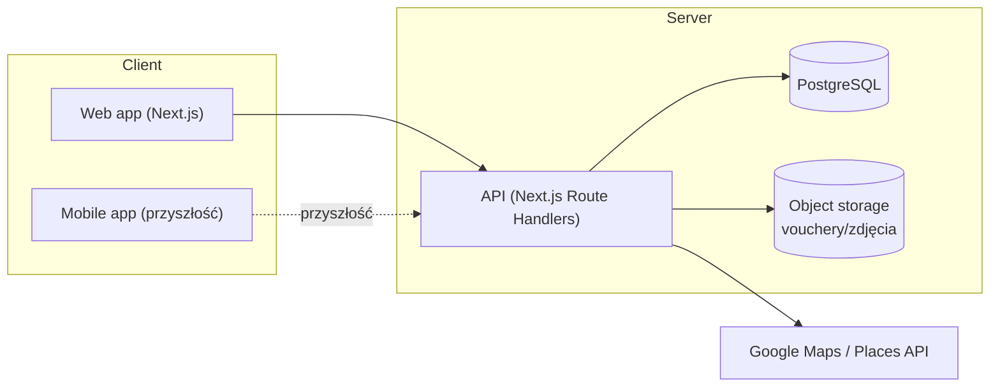

# Architektura — Karnet.asist

> Nazwa projektu: Karnet.asist · Wersja: v2 · Zapisano: 2026-08-02 00:08

> Status: DRAFT na podstawie prototypu `karnet-asist-prototyp_v6.html`. Stos techniczny
> potwierdzony (ADR-001, ADR-002) — patrz [DECISIONS.md](DECISIONS.md). Reszta
> architektury (przepływy, encje) nadal w statusie DRAFT do weryfikacji przy
> implementacji.

## Widok systemu

W prototypie frontend, "backend" i "baza danych" to jeden statyczny plik HTML z danymi
trzymanymi w pamięci JS (`let cards = [...]`, `let partners = [...]`) — znikają po
odświeżeniu strony. Produkcyjna wersja rozdziela to na realny frontend, API i trwałą bazę
danych.

## Kluczowe encje domenowe

| Encja | Odpowiednik w prototypie | Opis |
|---|---|---|
| `User` | — (niejawny „JD”) | Konto opcjonalne, tylko do synchronizacji między urządzeniami |
| `Company` (partner) | `partners[]` | Firma/klub powiązana z jednym lub wieloma karnetami |
| `Card` (karnet) | `cards[]` | Karnet użytkownika w danej firmie: typ `limit`/`unlimited`, licznik wejść, opcjonalna data ważności |
| `Visit` (wejście) | `card.history[]` | Pojedyncze wejście: data, opcjonalna godzina, opcjonalna notatka |
| `Category` | `cat` (`silownia`/`basen`/`zajecia`/`masaz`/`kosmetyka`) | Kategoria firmy/karnetu, determinuje styl (sport/relax) i ikonę |

Pełny schemat pól i relacji: [DATABASE.md](DATABASE.md).

## Przepływy najważniejszych operacji

**Dodanie wejścia** — użytkownik klika „+” na kafelku lub w szczegółach karnetu →
inkrementacja `used` (dla typu `limit`) → nowy wpis w historii z dzisiejszą datą →
przeliczenie statusu archiwizacji.

**Dodanie karnetu** — kreator 3-krokowy: (1) firma istniejąca / nowa / wybrana z Google
Maps + kategoria, (2) typ karnetu (limit + liczba wejść, lub bez limitu) + data ważności
(wymagana tylko dla „bez limitu”), (3) voucher/QR (jeden dla karnetu lub osobny na
wejście) + podsumowanie → zapis.

**Archiwizacja** — reguła obliczana przy każdym renderze, nie jest osobnym stanem
zapisanym ręcznie: `archived = usedUp || (expiry && expiry < dziś)`. W produkcji: albo
przeliczać tak samo w API/na żądanie, albo dodać kolumnę `status` aktualizowaną przy
zapisie i cronem/edge-function dla przypadków „czas minął bez akcji użytkownika”.

**Status ostrzegawczy karnetu** (`ok`/`soon`/`urgent`/`wygasł`/`brak terminu`) —
osobna etykieta liczona równolegle do `archived`, widoczna zanim karnet trafi do
archiwum. Konkretne progi dni/wejść: patrz `DATABASE.md`, sekcja „Status karnetu —
progi”.

**Edycja/usunięcie wejścia i daty ważności** — operacje na pojedynczym rekordzie
`Visit`/polu `Card.expiry`, z walidacją: karnet typu `unlimited` zawsze wymaga daty
ważności, `limit` — nie.

**Usunięcie karnetu** — zawsze poprzedzone potwierdzeniem (modal), operacja nieodwracalna
w prototypie → w produkcji rozważyć miękkie usuwanie (`deletedAt`) zamiast trwałego, dla
możliwości odzyskania.

**Podgląd partnera** — po kliknięciu firmy (lista lub pinezka mapy) pokazywane są karnety
użytkownika powiązane z tą firmą (`card.name === partner.name` w prototypie — w produkcji
klucz obcy `Card.companyId`).

## Dlaczego proponowany stos

- **Next.js + TypeScript** — jeden framework dla frontendu i API, dobre wsparcie SSR/PWA,
  łatwe do rozszerzenia o React Native (współdzielenie logiki i typów) w przyszłości.
- **PostgreSQL + Prisma** — relacyjny model dobrze pasuje do encji Karnet/Firma/Wejście z
  jasnymi relacjami 1:N; Prisma daje typowany dostęp do danych spójny z TS.
- **Konto opcjonalne** — zgodnie z założeniem produktowym; wymaga jednak od początku
  projektowania danych tak, by karnety mogły istnieć **bez** `userId` (urządzenie lokalne)
  i dać się później „przypiąć” do konta przy rejestracji/synchronizacji.
